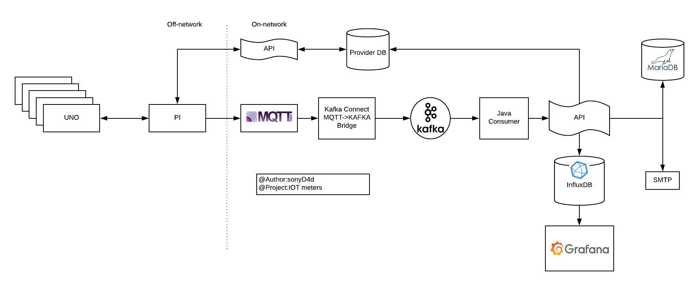
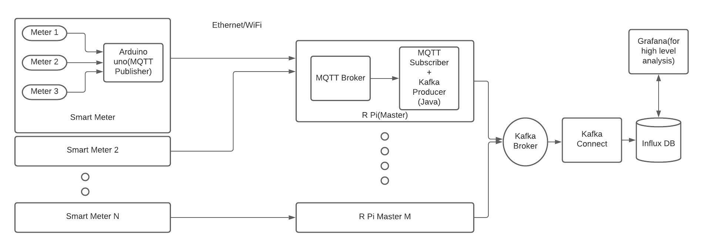

# Automated Smart Meters
An IoT-based smart utility meter that integrates and monitors the consumption readings of multiple utility meters like electricity, water, etc. It is backed up with a scalable and distributed message passing system(Kafka) for load handling and a time-series database for storing these events. Thus, providing a billing mechanism and timely analysis for end users and service providers

Architecture:

## Work Flow
### Meters
    - Connect all the meters to UNO and UNO to PI (MS setup)
    - Keep track of all the meters readings in local storage 
### Network bridge
    - Network queuing is controlled with MQTT and Kafka Queueing system to maintain consistency  and scalability 
    - This is a producer-consumer system ,where PI will act as a producer and a utility consumer will consume this data 
### Kafka Consumer
    - If the data is available in Kafka, then the consumer will send these data to a APIs
### Further processing 
    - Provide user an interactive interface for bill, payments analysis,etc.
    - The data from Influx data can be utilized for High level analysis.

    
